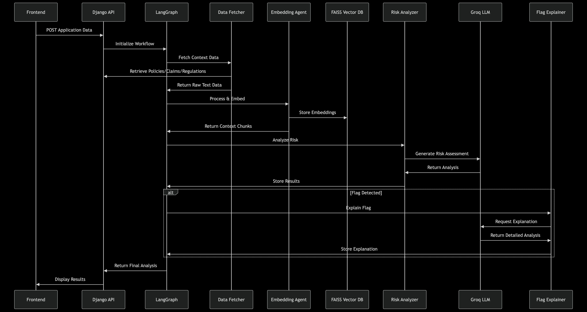

# MyChoice App

A comprehensive web application for managing items categorized by groups with an integrated AI-powered policy management and risk assessment system.

## Project Structure

The application consists of three main parts:
- **Backend**: Django REST API with integrated underwriting and policy management
- **Frontend**: React application
- **AI Policy Management System**: LangGraph-based intelligent workflow for policy analysis, risk assessment, and decision making

## Prerequisites

- Python 3.8+
- Node.js 18+
- npm 8+

## Getting Started

### Backend Setup

1. Navigate to the backend directory
   ```
   cd backend
   ```
2. Create Virtual Environment

Before installing dependencies, create a virtual environment:

**On macOS/Linux:**
```bash
python -m venv venv
source venv/bin/activate
```

**On Windows:**
```bash
python -m venv venv
venv\Scripts\activate
```

3. Install Python dependencies
   ```
   pip install -r requirements.txt
   ```

4. Apply database migrations
   ```
   python manage.py migrate
   ```

5. Start the Django server
   ```
   python manage.py runserver
   ```
   The backend will be available at http://localhost:8000

### Frontend Setup

1. Navigate to the frontend directory
   ```
   cd frontend
   ```

2. Install JavaScript dependencies
   ```
   npm install
   ```

3. Start the React development server
   ```
   npm start
   ```
   The frontend will be available at http://localhost:3000

## API Endpoints

### Items API
- **GET /items/**: List all items
- **POST /items/**: Create a new item
- **GET /items/{id}/**: Retrieve a specific item
- **PATCH /items/{id}/**: Update a specific item

### Underwriting API
- **POST /underwriting/applications/**: Submit a new application for underwriting
- **GET /underwriting/applications/{id}/**: Retrieve application status and results
- **POST /underwriting/analyze/**: Analyze application data through AI workflow
- **GET /underwriting/policies/**: List policy documents and regulations

## AI Policy Management System

The application includes an advanced AI-powered policy management system built with LangGraph that provides intelligent underwriting, risk assessment, and policy analysis capabilities.




### System Components

- **LangGraph Orchestrator**: Manages the entire workflow and agent coordination
- **Data Fetcher**: Retrieves relevant policies, claims, and regulatory information
- **Embedding Agent**: Converts documents into vector representations for semantic search
- **FAISS Vector Database**: Stores and retrieves document embeddings efficiently
- **Risk Analyzer**: Evaluates applications against risk criteria and generates assessments
- **Flag Explainer**: Identifies potential issues and provides detailed explanations
